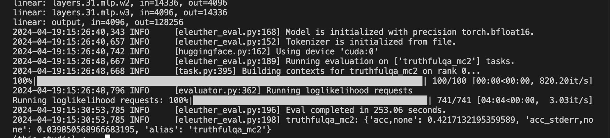
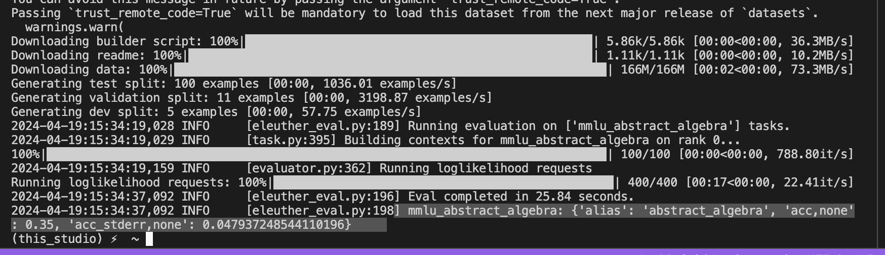
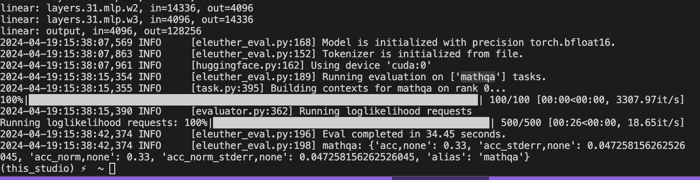
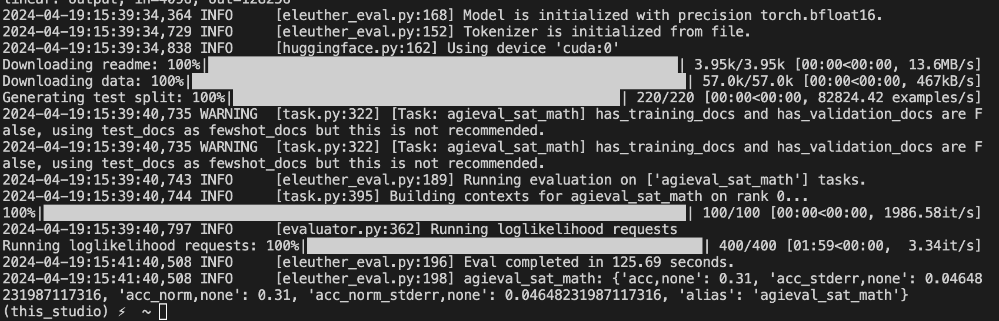

## Instruction Tuning LLAMA3 
<a target="_blank" href="https://lightning.ai/someshfengde/studios/llama-3-instruction-tuning">
  
</a>

This repo uses the `torchtune` for instruction tuning the llama3 pretrained model on mathematical tasks using LORA. 


studio link: 
https://lightning.ai/someshfengde/studios/llama-3-instruction-tuning

### Wandb report link
https://wandb.ai/som/torchtune_llama3?nw=nwusersom

## Instruction_tuned Model 
https://huggingface.co/Someshfengde/llama-3-instruction-tuned-AIMO

### Original metallama model 
https://huggingface.co/meta-llama/Meta-Llama-3-8B


## For running this project 
```
> pip install poetry 
> poetry install 
```
Further commands over shell terminal


### To download the model 
```
tune download meta-llama/Meta-Llama-3-8B \
--output-dir llama3-8b-hf \
--hf-token <HF_TOKEN> 
```

**To start instruction tuning with lora and torchtune**
```
tune run lora_finetune_single_device --config ./lora_finetune_single_device.yaml
```


### To quantize the model
```
tune run quantize --config ./quantization_config.yaml

```

### Finetuned model 
```
./llama-3-instruction-tuned-math
├── LICENSE
├── README.md
├── USE_POLICY.md
├── adapter_0.pt ## lora finetuned adapter 
├── config.json
├── generation_config.json
├── meta_model_0-4w.pt ## quantized model 
├── meta_model_0.pt ## original metallama model. 8b
├── model.safetensors.index.json
├── special_tokens_map.json
├── tokenizer.json
├── tokenizer.model
└── tokenizer_config.json
```
### To generate inference from model.
```
tune run generate --config ./generation_config.yaml \
prompt="what is 2 + 2."
```

## Dataset used 
Contains various math problems (Math olympiad problems.)

https://huggingface.co/datasets/Someshfengde/AIMO_dataset

### Evaluations 

**To run evaluations** 
```
tune run eleuther_eval --config ./eval_config.yaml
```
### TruthfulQA: 0.42


### MMLU Abstract Algebra: 0.35


### MATHQA: 0.33


### Agieval_sat_math: 0.31 
